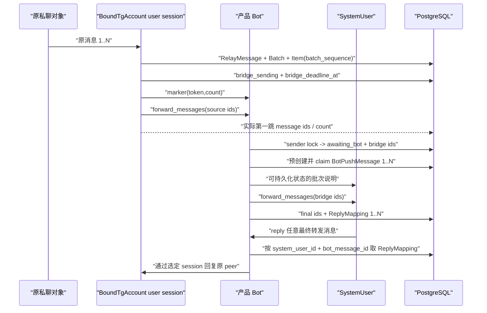

# TG 原生双向转发 V2 技术方案

## 结论

采用“两跳原生转发桥”，不继续使用 Bot 复制正文/媒体。该桥的安全边界是**一个真实 Telegram 账号只对应一个 BoundTgAccount，且同一 `telegram_user_id` 的桥接事件严格串行**。



Bot 不能直接转发它从未收到且无权访问的绑定账号私聊；因此 BoundTgAccount 必须先把原消息转入 Bot 私聊，再由 Bot 完成最终原生转发。任何远端副作用未知的场景都进入 `uncertain`，不重发、不复制。

## 方案比较

| 方案 | 结果 | 决策 |
| --- | --- | --- |
| Bot 继续 `send_message` / `send_file` | 无原生 forward header，无法满足需求 | 拒绝 |
| BoundTgAccount 直接转发给 SystemUser | 消息出现在个人账号会话，不在当前 Bot 会话；回复入口改变 | 拒绝 |
| Bot 伪造“转发自”文本 | 仍不可点击，重名问题没有解决 | 拒绝 |
| BoundTgAccount -> Bot -> SystemUser 两跳原生转发 | 保持当前 Bot 会话和逐条 ReplyMapping | 采用 |

## 模块边界

### `services/native_forward.py`

- `NativeForwardCollector`：以账号、peer 和 source message id 持久化入站 RelayMessage，按账号和 peer 聚合、封批，并在同一事务中分配 `batch_sequence`。
- `NativeForwardDispatchService`：领取 sealed 批次，写 marker、`bridge_deadline_at`，按真实 `telegram_user_id` 驱动第一跳。
- listener refresh 负责封存/派发到期 collecting 或 sealed 批次；`NativeForwardReconciliationService` 将过期 `bridge_sending` / `awaiting_bot` / `final_sending` 标记为 `uncertain` 并发出明确通知；不自动重放。
- 服务只依赖 repository、时钟和 `UserSessionForwarder` 协议，不直接创建 Telethon client。

### `telegram/private_listener/native_forward.py`

- `TelethonUserSessionForwarder`：在已连接的 BoundTgAccount client 上先 `send_message(marker)`，再 `forward_messages`。
- 使用 `TG_V_CHAT_BOT_USERNAME` 在该 user session 内解析目标 Bot peer；不得从 Bot token 推断 username，也不得把 Bot session 的 access hash 交给 user session。
- 返回 `FirstHopForwardResult(forwarded_count)`，调用方必须校验 `forwarded_count == expected_count`；不返回或持久化发送侧的 marker/item message id。
- 使用 listener 已有的 source peer access hash；不把账号 A 的 access hash 交给 Bot 账号使用。
- 同一真实 `telegram_user_id` 同时只允许一个 `bridge_sending` 批次；锁使用 PostgreSQL advisory lock，不能只按 BoundTgAccount 主键。
- photo、video、video_note、audio、voice、sticker 只记录 source_message_id 和媒体类型，不下载或重新上传媒体。

### `telegram/telethon_clients/forward_bridge.py`

- `BotForwardBridgeHandler`：在普通 Bot router 之前消费 marker、bridge item 和 bridge album。
- 对同一 sender 的每个 update 先取得 PostgreSQL sender advisory lock；有效 marker 和 item 在该锁内完成状态提交，防止 marker 尚未落库时下一条 forwarded item 进入普通 router。
- marker 必须同时满足 token 存在、sender Telegram user id 匹配、batch 状态允许、expected_count 匹配。
- 已知 BoundTgAccount sender 的未知 marker、错误 marker、没有 active marker 的 forwarded item 都写 `NativeForwardBridgeQuarantine` 无内容审计记录，绝不进入账号管理或 reply router。
- 仅在持久化处理完成后使用 Telethon 1.x `events.StopPropagation`；`NewMessage` 与 `Album` 必须共享相同 bridge 判定和 sender lock。

### `storage/repositories/native_forward.py`

- 只提供 create/append/seal/claim/transition/lookup/expire/quarantine 方法。
- RelayMessage 的入站幂等键必须是 `bound_tg_account_id + peer_id + source_message_id`，不能把不同 peer 相同的 Telegram message id 视为重复。
- `append_item` 在同一事务中读取/分配下一个 `batch_sequence`；不接受调用方传入的 RelayMessage media sequence。
- 状态迁移使用带当前状态条件的 update；服务层不直接改 ORM 字段。
- active bridge 只能按 `bridge_sender_telegram_user_id` 查询；由于身份唯一约束，每个 sender 同时至多一个 active batch。
- 账号禁用/删除必须先取得 account lock，再取得该账号 `telegram_user_id` 的 bridge lock，终止 collecting/sealed/bridge_sending/awaiting_bot/final_sending 批次后才失效 ReplyMapping；bridge handler 持有同一 identity lock 覆盖最终 RPC 和 mapping 落库，因此不会在禁用/删除后重建 active mapping。

## 数据模型

### `bound_tg_accounts.telegram_user_id`

- `BIGINT NULL` 迁移，登录成功及 listener startup 时由 `get_me().id` 回填。
- 对非 NULL 值建立全局唯一约束；已有重复值必须在启用 V2 前显式解除/重绑，不能把一个真实 Telegram 账号绑定给两个 SystemUser。
- 新原生转发只允许该字段已存在的 active/degraded 账号；缺失时返回 `bound_account_identity_missing`。
- 不从手机号、display_name 或 username 推断。

### `native_forward_batches`

```text
id INTEGER PK
system_user_id FK NOT NULL
bound_tg_account_id FK NOT NULL
bridge_sender_telegram_user_id BIGINT NOT NULL
source_peer_id BIGINT NOT NULL
source_peer_access_hash BIGINT NULL
marker_token VARCHAR(128) UNIQUE NOT NULL
expected_count INTEGER NOT NULL CHECK (expected_count BETWEEN 0 AND 100)
status VARCHAR(32) NOT NULL
collect_until TIMESTAMPTZ NOT NULL
bridge_deadline_at TIMESTAMPTZ NULL
header_bot_message_id INTEGER NULL
failure_code VARCHAR(64) NULL
failure_reason TEXT NULL
created_at / updated_at TIMESTAMPTZ NOT NULL
```

状态约束：`collecting, sealed, bridge_sending, awaiting_bot, final_sending, sent, failed, uncertain`。

### `native_forward_items`

```text
id INTEGER PK
batch_id FK NOT NULL
relay_message_id FK UNIQUE NOT NULL
batch_sequence INTEGER NOT NULL
bridge_sender_telegram_user_id BIGINT NOT NULL
bridge_message_id INTEGER NULL
bot_push_message_id FK NULL
final_bot_message_id INTEGER NULL
identity_visibility VARCHAR(32) NULL
status VARCHAR(32) NOT NULL
UNIQUE(batch_id, batch_sequence)
UNIQUE(bridge_sender_telegram_user_id, bridge_message_id)
```

`batch_sequence` 是批次展示顺序，始终从 1 开始递增；它与 RelayMessage 的 album/media `sequence` 没有任何复用关系。第一跳 RPC 只确认 `forwarded_count`；不持久化第一跳发送侧的 marker 或 item message id。有效 marker 后，Bot 端按同一 sender 的 Bot 私聊 message id 顺序把消息写入未 bridge 的 item，并把实际收到的 `bridge_message_id` 作为唯一关联键。Telegram message id 仅在所属私聊内唯一，不能跨会话比较。

状态约束：`pending, bridged, sent, failed, uncertain`。

### `native_forward_bridge_quarantines`

```text
id INTEGER PK
sender_telegram_user_id BIGINT NOT NULL
bot_message_id INTEGER NOT NULL
marker_token VARCHAR(128) NULL
failure_code VARCHAR(64) NOT NULL
created_at TIMESTAMPTZ NOT NULL
```

该表是路由隔离审计，不保存原私聊正文、caption 或媒体。它覆盖 `bridge_marker_mismatch`、`bridge_orphan_forward` 和 `bridge_item_count_mismatch`，使错误 bridge 输入既可追踪，又不会被普通 Bot 输入流消费。

### 既有 `bot_push_messages` 与 `reply_mappings`

- 第二跳前每个 item 必须已有一个 `BotPushMessage(pending)`，并以 `push:{relay_message_id}` 的既有幂等键 claim 为 `sending`。
- 只有成功持久化最终 `bot_message_id` 时才创建 `ReplyMapping`；lookup 和唯一性继续使用 `system_user_id + bot_message_id`。
- 如果 Telegram 已成功而本地提交失败，预创建的 push/item/batch 均进入 `uncertain`。不创建猜测性的 ReplyMapping，不自动发送第二份消息。

## 批次、锁和 Marker 协议

### 批次算法

1. key 固定为 `(bound_tg_account_id, peer_id)`。
2. 新普通消息寻找仍在 collecting 且未过 `collect_until` 的批次；存在则在同一事务中追加 item、分配 `batch_sequence` 并更新 `collect_until`，否则创建 sequence 为 1 的新批次。
3. photo/video 混合 album 作为完整批次一次创建并立即 sealed；audio、voice、video_note 按普通消息进入静默窗口。collecting 追加和到期 sealed 必须取得同一 BoundTgAccount lock，避免 append 与 seal 在边界并发时把消息落进错误批次。
4. listener reconciliation 循环在同一 BoundTgAccount lock 内领取到期 collecting 和 sealed 批次，保证进程重启后可继续。
5. 超过 Telegram 单次 100 条限制时，按 `batch_sequence` 拆成相邻批次；新批次重新从 1 分配 sequence。
6. 第一跳 lock key 为 `telegram_user_id`；Bot bridge lock key 也是同一值。数据库唯一约束和 advisory lock 共同保证不会有两个 active bridge 竞争同一 sender。

### Marker 格式和消费规则

```text
tgvc-forward-v2:{marker_token}:{expected_count}
```

- marker_token 使用随机 URL-safe token，并预先持久化。
- dispatch 在 `sealed -> bridge_sending` 前计算并保存 `bridge_deadline_at = now + TG_V_CHAT_NATIVE_FORWARD_BRIDGE_TIMEOUT_SECONDS`。
- marker handler 在 sender lock 内验证 token、sender、状态和 count，成功后转为 `awaiting_bot`。
- 第一跳完成后服务必须在 sender lock 内核对 `forwarded_count`；不匹配则立即进入 `uncertain`，不会写入发送侧的 message id。
- item handler 在有效 marker 后只消费同一 sender 的 active batch，按 Bot 私聊 message id 顺序写入下一个未 bridge item；重复 Bot 私聊 message id 必须幂等。
- 已知绑定 sender 的未知/错误 marker、orphan forwarded message 或超过批次条数的 forwarded item 必须写入 `native_forward_bridge_quarantines`，不能落入普通 router。非绑定 sender 的普通消息维持现有行为。
- marker、bridge item 和 batch header 都不创建 ReplyMapping。

## 两跳结果处理

### 第一跳

1. `sealed -> bridge_sending` 和 `bridge_deadline_at` 在 RPC 前提交。
2. adapter 先发送 marker，再按 `batch_sequence` 递增的 source id 转发，只返回 `forwarded_count`；Bot 私聊收到 marker 后按其实际 message id 建立批次关联，后续 Bot 私聊 item id 才是持久化关联键。
3. 明确的 protected/missing/peer 错误在确认未产生远端副作用时进入 failed。
4. 连接中断、超时、成功后无法持久化、或返回数量不等于 expected_count 时进入 uncertain。
5. reconciliation 发现 deadline 已过的 `bridge_sending`、`awaiting_bot` 或 `final_sending` 时进入 `bridge_timeout` / uncertain，通知 SystemUser，不重发。

### 第二跳

1. 收齐 expected_count 后，在 sender lock 内 CAS `awaiting_bot -> final_sending`。
2. 先为全部 item 创建并 claim `BotPushMessage`；任一预创建/claim 失败时不发第二跳。
3. Bot 发送批次说明并持久化 `header_bot_message_id`。说明初始文案表明“正在转发”；失败/uncertain 时必须编辑该说明或发送明确终态通知。
4. 对按 `batch_sequence` 排序、已由 Bot 私聊实际消息持久化的 `bridge_message_id` 调用 `forward_messages`。
5. 结果数量相等时，按 batch_sequence 成对持久化 final bot message id、BotPushMessage sent、NativeForwardItem sent 和 ReplyMapping，再转 batch sent。
6. 数量不足、传输未知、远端成功后本地提交失败时，把已有预创建 push/item/batch 标记 uncertain；不自动补发、复制或猜测 message id。人工 reconciliation 只能在核对真实 Bot 对话后补录确认结果。

## 失败、恢复与通知

| 类别 | 终态 | 用户可见结果 | 自动动作 |
| --- | --- | --- | --- |
| 远端明确拒绝且无副作用 | failed | 批次说明显示失败 code | 不重试、不复制 |
| 第一跳/第二跳数量不一致 | uncertain | 批次说明显示 `bridge_item_count_mismatch` | 不重试 |
| 第一跳返回条数不等于 expected_count | uncertain | `bridge_item_count_mismatch` | 不重试、不串批 |
| bridge deadline 到期 | uncertain | 批次说明显示 `bridge_timeout` | 不重试 |
| 已知 sender 的错误 bridge 输入 | quarantined | 写无内容隔离审计，不进入普通 Bot 流程 | 不转发 |
| 远端成功后本地提交失败 | uncertain | 批次说明显示需要人工核对 | 不重试 |

- collecting/sealed：可安全恢复，因为尚未产生远端副作用。
- bridge_sending/awaiting_bot/final_sending：重启或 deadline 后进入 uncertain，不自动重放。
- sent：重复 update 返回已有结果，不再转发。
- failed 和 uncertain：展示持久化 failure code/reason；任何人工修复必须保留审计记录。

## 灰度、回填与兼容策略

- 配置名固定为 `TG_V_CHAT_NATIVE_FORWARD_V2_ENABLED`，默认 `false`。关闭时保持当前 V1 入站复制路径；这是显式整链路开关，不是单条失败 fallback。
- `TG_V_CHAT_BOT_USERNAME` 是 V2 为 `true` 时必填的 Bot target 配置，格式为不含 `@` 的 Telegram username；缺失时明确 `bot_username_missing`，不尝试跨 session 复用 access hash。
- 授权完成时，必须在写入 session/profile 的同一事务内先写入 `get_me().id` 到 `BoundTgAccount.telegram_user_id`，再计算 active/degraded；删除账号时清空软删除行的 `telegram_user_id`，以允许同一真实账号重新绑定。listener identity refresh 必须先取得 account lock 再取得 identity lock，并拒绝向已删除账号写回旧 identity。
- 启用顺序固定为：迁移 -> listener `get_me()` 回填 active/degraded 账号 -> 解决重复 `telegram_user_id` -> 配置 Bot username -> PostgreSQL 完整率查询为 100% -> 显式把开关设为 `true`。
- 任一步未满足，V2 不启用；已启用后某条消息失败只记录 native-forward 失败，不降级为复制正文/媒体。
- V2 开启后，入站主链路替换当前 `TelethonBotGateway.send_message/send_file` 复制路径；出站 Bot reply、Session failover、账号管理不改业务口径。
- 入站原生转发不需要 media spool；出站媒体回复仍使用 `TG_V_CHAT_MEDIA_ROOT`。
- 入站 `MediaKind` 扩展为 `TEXT, PHOTO, VIDEO, VIDEO_NOTE, AUDIO, VOICE, STICKER`；普通 document、GIF、联系人和位置继续明确拒绝。
- 依赖固定为 `telethon>=1.34,<2`。当前路由使用 Telethon 1.x `events.StopPropagation`；升级到 2.x 必须先重做事件桥接并通过完整 E3/E4。

## 发布门槛

- E3：本地 SQLite 单测、PostgreSQL migration SQL 生成、compileall 和 compose config 必须通过；在线 PostgreSQL integration 仅在提供测试数据库时另行取证，不能由 SQL 生成替代。2026-07-18 本地 E3 已通过；覆盖普通多消息 sequence、跨账号同 id 隔离、第一跳 forwarded_count、Bot marker 先到、Bot 私聊 id 顺序归属、重复账号拒绝、授权 identity 落库、删除后重绑、Bot username 缺失、桥接超时、第一跳数量不一致、预创建 push、账号不可用终态提交、远端成功后 DB 失败、`777000` contract 和 feature-gate 回填。
- 发布：`master -> release -> GitHub Actions Deploy Production`。
- E4：真实账号验证 linked、name_only、三条普通文本批次、photo/video 混合相册、video_note、audio、voice、逐条回复、protected failure、marker timeout、重启 uncertain、重复账号拒绝、V2 启用前完整率检查，以及隔离测试账号上的 `777000` 原始 code 流程。缺任一项都不得宣称生产完成。
